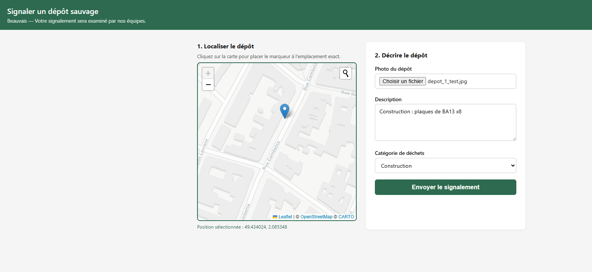
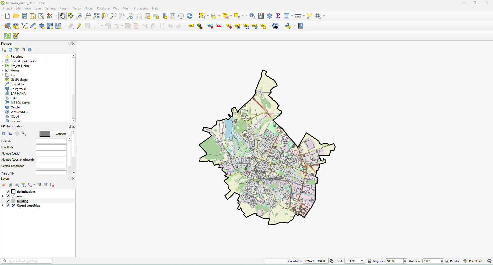
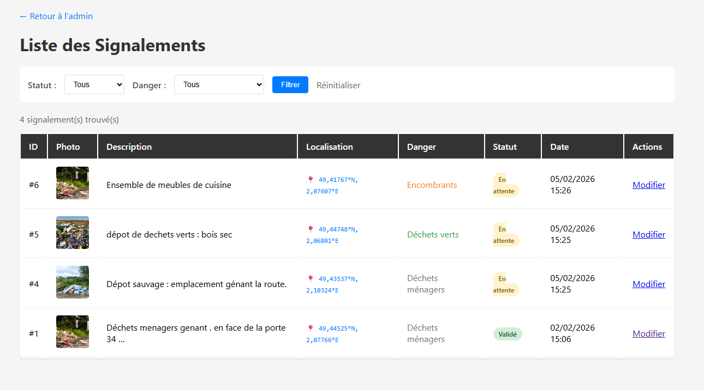
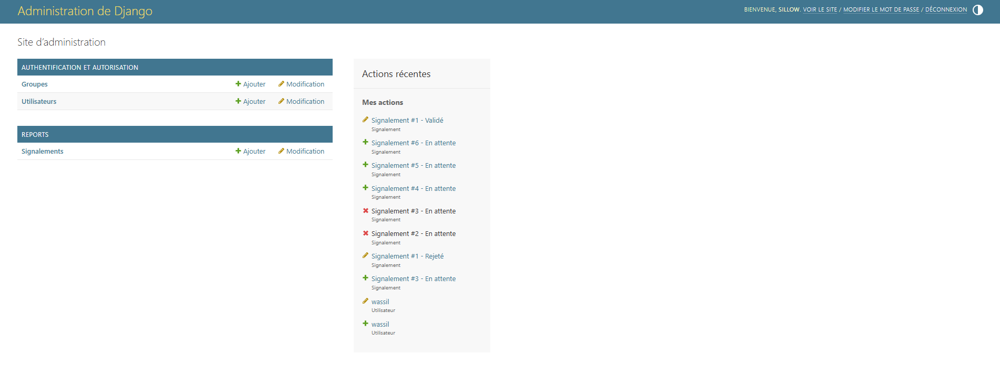

# Dump Alert


Application Django/GeoDjango de signalement de dépôts sauvages avec géolocalisation et clustering automatique.

## Fonctionnalités

- Signalement avec upload d'image et catégorie de déchets (6 types)
- Validation/rejet des signalements par un administrateur
- Géolocalisation sur carte interactive Leaflet (recherche d'adresse limitée à Beauvais)
- Clustering automatique des signalements à ≤10m les uns des autres (PostGIS + DWithin)
- Interface d'administration avec carte Leaflet et actions en masse
- Visualisation des clusters dans QGIS via connexion PostGIS

## Prérequis

- Python >= 3.11
- [uv](https://github.com/astral-sh/uv)
- [QGIS](https://qgis.org/) ou [OSGeo4W](https://trac.osgeo.org/osgeo4w/) (Windows) pour les bibliothèques GDAL/GEOS
- Docker (pour la base PostgreSQL/PostGIS)

## Installation (Windows)

```bash
# 1. Lancer la base de données PostGIS (conteneur docker)
docker run -d --name dump-alert-db \
  -e POSTGRES_USER=postgres \
  -e POSTGRES_PASSWORD=postgres \
  -e POSTGRES_DB=dump_alert \
  -p 5433:5432 \
  postgis/postgis:16-3.4

# 2. Ouvrir "OSGeo4W Shell" depuis le menu Démarrer (installé avec QGIS)

# 3. Naviguer vers le projet
cd path_to/Dump-Alert

# 4. Activer l'environnement virtuel et démarrer
.venv\Scripts\activate
python manage.py migrate
python manage.py createsuperuser
python manage.py runserver
```

## Lancer les tests

```bash
.venv\Scripts\activate
python manage.py test reports --verbosity=2
```

Couverture : modèles (`ReportCluster`), services (`merge_clusters`, `assign_report_to_cluster`), vues (`create_report`, `report_list`).

## Pre-commit

Les hooks vérifient automatiquement le code avant chaque commit/push.

```bash
# Installation (une seule fois)
pip install pre-commit ruff
pre-commit install                        # hook commit → ruff lint + format
pre-commit install --hook-type pre-push   # hook push  → tests Django

# Lancer manuellement sur tous les fichiers
pre-commit run --all-files
```

| Étape | Hooks actifs |
|-------|-------------|
| `git commit` | check-yaml, trailing-whitespace, gitleaks, ruff lint, ruff format |
| `git push` | Django unit tests (20 tests) |

## Données de test (clustering)

```bash
# TEST : Insérer 10 signalements groupés à ≤10m (déclenche le clustering automatique)
python manage.py seed_cluster_test

# TEST : Choisir le type de déchets et la position centrale
python manage.py seed_cluster_test --waste-type asbestos --lat 49.431 --lon 2.082

# Supprimer les données de test
python manage.py seed_cluster_test --delete
```

## Architecture

```
reports/
├── models.py       — Report, ReportCluster, WASTE_TYPE_SEVERITY
├── services.py     — assign_report_to_cluster, merge_clusters
├── signals.py      — post_save → clustering automatique
├── views.py        — create_report, report_list, report_success
├── forms.py        — ReportForm
├── admin.py        — ReportAdmin, ReportClusterAdmin
└── tests.py        — Tests unitaires (modèles, services, vues)
```

## Connexion QGIS

| Paramètre  | Valeur       |
|------------|--------------|
| Hôte       | localhost    |
| Port       | 5433         |
| Base       | dump_alert   |
| Utilisateur | postgres     |
| Mot de passe | postgres    |

Couches disponibles : `reports_report`, `reports_reportcluster`

## Technologies

Django 5.2 • GeoDjango • PostGIS 16 • django-leaflet • leaflet-control-geocoder • Pillow • QGIS 3.40





